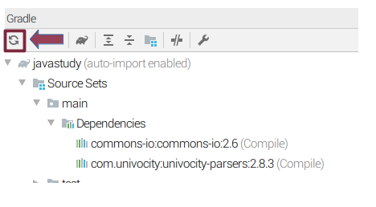

# 사실은 되게 유용한 자바 프로젝트(1)


## Git

### 버전 관리 시스템

소스 코드 관리 시스템입니다. 커밋 단위로 모든 소스 코드를 트래킹할 수 있으며, 각 커밋은 고유한 해시값을 가집니다.

커밋 기준으로 굉장히 많은 일을 할 수 있는데요,

커밋 기준으로 그 커밋에 매핑된 태그를 태깅하여 GPG, 정식 버전 등의 의미를 부여할 수 있습니다.

또 커밋 해쉬 값을 가져와 특정 시점의 코드를 가져와서 현재 코드에 적용할 수 있습니다.(cherry pick)

등등등..

어쨌든 커밋이 unique하게 존재하기 때문에 많은 것을 할 수 있다는 것만 이해하면 됩니다. 


**<노란색으로 해시값 일부가 명시되었음>**

### 일반적인 코드 관리 흐름

master branch가 주 흐름을 가진 branch가 되며, 프로젝트의 일부 기능을 구현할 때, 변경할 때 곁다리로 branch를 따서 구현합니다.

구현이 완료되면 해당 branch를 master에 merge하는 방식으로 프로젝트 소스가 관리됩니다. 

****

**<프로젝트 브랜치 graph(빨간색이 master)>**


## Gradle

Gradle은 빌드 툴입니다.

### 빌드 툴

Gradle은 [CICD](https://www.redhat.com/ko/topics/devops/what-is-ci-cd)의 요소 중에 하나인 '빌드 자동화' 툴입니다.

Ant, Maven의 단점을 보완하여 만들어졌다고 들었는데 여러모로 확실히 편리합니다.

build는 쉽게 말해 소스코드가 없는 executable file을 생성하는 것이라고 할 수 있습니다. 

executable file은 소비자의 입장을 고려한 것이라고 볼 수 있겠죠!

### build.gradle

build.gradle 파일에서 빌드 관련 다양한 설정을 할 수 있습니다. 

gradle init --type java-library 명령어나 IDE를 통해 Gradle project를 생성하면 다음과 같은 구조가 생겨납니다.<br>

시작해서.<br>
├── build.gradle

├── gradle

│   └── wrapper

│       ├── gradle-wrapper.jar

│       └── gradle-wrapper.properties

├── gradlew

├── gradlew.bat

├── settings.gradle

└── src

​    ├── main

​    │   └── java

​    │       └── Library.java

​    └── test

​        └── java

​            └── LibraryTest.java


아래는 명령어를 통해 기본적으로 생성되는 build.gradle 파일입니다. IDE 마다 생성되는 build.gradle 파일의 내용이 조금씩 달라질 수는 있지만 아래 파일 수준으로 생성해줍니다.

```groovy
/* * This build file was generated by the Gradle 'init' task. * * This generated file contains a sample Java Library project to get you started. * For more details take a look at the Java Libraries chapter in the Gradle * user guide available at https://docs.gradle.org/4.4.1/userguide/java_library_plugin.html */
// Apply the java-library plugin to add support for Java Library

apply plugin: 'java-library'
// In this section you declare where to find the dependencies of your project

repositories {
 // Use jcenter for resolving your dependencies.  
 // You can declare any Maven/Ivy/file repository here.  
jcenter()
    
}
dependencies {
// This dependency is exported to consumers, that is to say found on their compile classpath.
api 'org.apache.commons:commons-math3:3.6.1'4
  // This dependency is used internally, and not exposed to consumers on their own compile classpath.  
implementation 'com.google.guava:guava:23.0'
  // Use JUnit test framework 
testImplementation 'junit:junit:4.12'
}
```

이제 위 파일의 의미를 하나하나 살펴보도록 하겠습니다.


#### **apply plugin: 'java-library'**

자바 기본 라이브러리를 plugin으로 적용해준다는 뜻입니다.

그래야 build할때 compileJava 과정을 통과할 수 있습니다.

#### **repositories**

외부 라이브러리를 다운로드할 원격 repository를 지정해줍니다. 

보통 jcenter()나 mavenCentral()이 들어갑니다. 원하는 외부 라이브러리에 맞게 더 추가해주면 됩니다.

#### **dependencies**

의존하는 라이브러리들을 쭈르륵 적어줍니다.

문법 구조가 [관련작업] [의존하는 라이브러리] 요런 식으로 적혀있습니다.


> 예를 들어,

**compile group: 'commons-io', name: 'commons-io', version: '2.6'** 의 경우는 compile 작업을 할때 의존하는 라이브러리가 apache commons io라는 뜻이 됩니다. 왼쪽에 관련 작업이 나오고, 오른쪽에 의존하는 라이브러리가 나오는 구조입니다.

#### gradle wrapper

wrapper는 말그대로 gradle 프로젝트를 싸주는 애입니다. gradle project를 다운로드한 컴퓨터에 JDK가 깔려있다면 gradle이 설치되어있지 않아도 해당 프로젝트 안에서 build를 사용할 수 있습니다.

만약 컴퓨터에 gradle이 깔려있다면 프로젝트의 gradle 버전 기준으로 build가 실행됩니다. 이와 관련된 파일인 gradlew는 리눅스에서, gradlew.bat(배치파일)는 윈도우에서 gradle 명령어 대신 사용할 수 있습니다.


## Gradle 프로젝트 생성하기


<br>gradle, java 프로젝트를 선택해서 생성합니다.

artifact id, group id는 맘대로 입력합니다.

원래는 group id는 distinct한 프로젝트 구별을 위한것이고 artifact id는 jar파일이 그 이름으로 생깁니다. 

## 의존성 이해하기

```groovy
dependencies {  
    // This dependency is exported to consumers, that is to say found on their compile classpath.  
    api 'org.apache.commons:commons-math3:3.6.1'
  // This dependency is used internally, and not exposed to consumers on their own compile classpath.  
    implementation 'com.google.guava:guava:23.0'
  // Use JUnit test framework  testImplementation 'junit:junit:4.12'
}


```

외부 라이브러리를 dependencies 블록에 추가하면 jar 파일을 안받고 쓸 수 있습니다. 

아까봤던 dependencies에 외부 apache commons io를 추가해봅니다.

## 외부라이브러리 추가하기

Maven Repository : https://mvnrepository.com/

여기에 들어가서 apache commons io를 검색한뒤 jcentral -> gradle에 있는 내용을 그냥 복붙하면 됩니다.

다음과 같이 나오면 됩니다.

```groovy
dependencies {  // This dependency is exported to consumers, that is to say found on their compile classpath.  
api 'org.apache.commons:commons-math3:3.6.1'
  // This dependency is used internally, and not exposed to consumers on their own compile classpath.  
  implementation 'com.google.guava:guava:23.0'
  // Use JUnit test framework  
  testImplementation 'junit:junit:4.12'
  // https://mvnrepository.com/artifact/commons-io/commons-io  
  compile group: 'commons-io', name: 'commons-io', version: '2.6'
}
```

## 빌드 과정 이해하기

먼저, MainControllor클래스를 src/main/java 폴더 밑에 생성하고 IOUtils 샘플 소스코드를 복붙합니다.

(http://commons.apache.org/proper/commons-io/description.html)

```java
public class MainController {

public static void main(String[] args){

//요기요!

}

}
```


IntelliJ 개꿀 원클릭 기능인 오른쪽 상단에서 gradle 버튼을 찾아서 화살표 빙빙 도는 버튼을 클릭합니다. gradle import 하는 버튼인데요, 그러면 위에서 추가한 commons-io 라이브러리를 에디터 상에서 사용할 수 있게 됩니다.



### 드뎌 빌드를 해보려는데..이거 먼저 합시다

작성한 소스 코드를 executable 파일로 만들기 위해서는 꼭 필요한 두가지를 build.gradle에 추가해줘야 합니다. 

> 첫번째,

```apply plugin: 'application'```을 통해 application을 만드는 플러그인을 적용해서  executable application을 만들 수 있도록 해줍니다.

> 두번째,

```application {  mainClassName = 'main.java.MainController'}```로 메인 클래스를 지정해줍니다.


지금까지의 내용을 설명한 build.gradle 파일은 다음과 같습니다.

**build.gradle**

```groovy
/* * This build file was generated by the Gradle 'init' task. * * This generated file contains a sample Java Library project to get you started. * For more details take a look at the Java Libraries chapter in the Gradle * user guide available at https://docs.gradle.org/4.4.1/userguide/java_library_plugin.html */
// Apply the java-library plugin to add support for Java Library

apply plugin: 'java-library'
apply plugin: 'application'
application {
    mainClassName ='main.java.MainController'
}
// In this section you declare where to find the dependencies of your project

repositories {  
    // Use jcenter for resolving your dependencies.  
    // You can declare any Maven/Ivy/file repository here.  
jcenter()
}

dependencies {  
    // This dependency is exported to consumers, that is to say found on their compile classpath.  
api 'org.apache.commons:commons-math3:3.6.1'
  // This dependency is used internally, and not exposed to consumers on their own compile classpath.
    implementation 'com.google.guava:guava:23.0'
  // Use JUnit test framework 
testImplementation 'junit:junit:4.12'
}
```

그런다음 IntelliJ 개꿀 원클릭 기능 distZip을 클릭해서 distributable zip 파일을 생성합니다. 


distZip 작업을 실행하면 컴파일작업 부터 여러 작업을 자동으로 실행해주고 결과물로 압축된 executable 파일을 생성해줍니다.

## executable 파일 실행하기

 ./build/distributions의 경로에 있는 zip 파일을 unzip 해줍니다.

그런 다음 build/distributions/javastudy-1.0-SNAPSHOT/bin 아래에 있는 쉘파일을 실행해줍니다.

<br>

와...오늘 기본 세팅을 끝냈으니 반은 한거나 다름없습니다. 

★빌드가 모다? executable file 자체를 의미하거나 executable file을 만드는 과정을 의미합니다.★


**오늘의 단축키** : Ctrl + y 를 누르면 커서가 있는 라인을 삭제해줍니다.